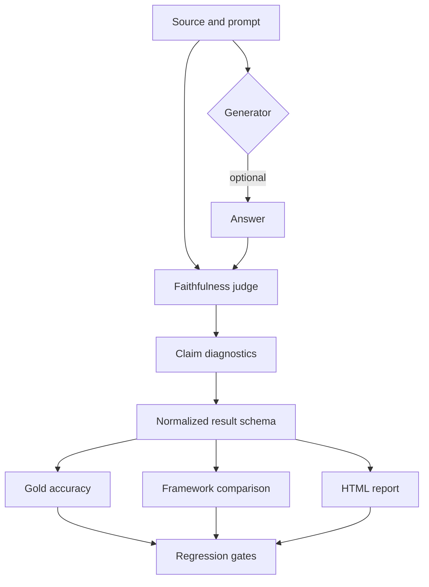
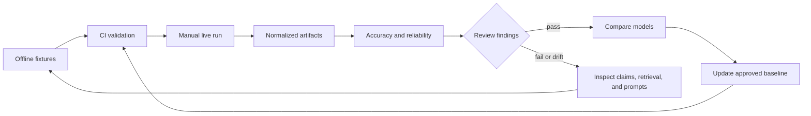

# TrueLearn Evals

This repository is TrueLearn's home for AI-content evaluation harnesses. It currently hosts one
project — **`maestro/`** — with more expected to land as siblings alongside it over time. It is an
**internal work in progress, not a released or fully reviewed product** — see [LICENSE](LICENSE)
and the open questions below before treating anything here as settled.

It has three parts:

1. **`maestro/`** — the first project: a QA/eval harness for **Maestro**, TrueLearn's
   AI content-generation backend, being integrated into the Payload CMS editorial tool. Future
   evaluation projects are expected to live as new siblings next to `maestro/`, following the same
   conventions (see below).
2. **`reference/`** — a supporting reference implementation of claim-decomposition faithfulness
   scoring (Promptfoo, DeepEval, RAGAS, all judged by Claude), used to prototype the "test the
   judge before trusting it" discipline that Maestro's Tier 3 LLM-judge work (below) is directly
   built on. Its content and fixtures are generic clinical-QA examples, predate any TrueLearn/
   Maestro involvement, and do not represent TrueLearn content, data, or clinical/editorial review
   in any way.
3. **`tools/`** — shared, project-agnostic infrastructure (normalized result schema, retry with
   backoff, regression gates, reliability analysis, HTML reporting, provider-usage/cost tracking).
   Used by `reference/`'s demos today, and by `maestro/judge/` directly; available to any future
   project without needing to be duplicated.

## Open questions TrueLearn needs to answer

These are tracked throughout the repo (as `EvalConfig`/`SmeRoster` fields that default to
unconfirmed, and as inline notes on placeholder data) rather than guessed at anywhere. Grounded
against a real TrueLearn system-architecture briefing (Confluence/Jira/Slack, late Aug 2026) where
noted — see `maestro/generation/` (below) for where that grounding actually lives in code.

### Resolved by the system briefing

- ~~What should Tier 3's real source-of-truth for "source material" be?~~ **Answered:** Maestro
  grounds *question* generation on a live web search — each generation carries its own
  `references.query` + `results[]` (external URLs like Physiopedia/PubMed, each with a relevance
  `score`), not a fixed internal corpus, and specifically **not** the separate Bedrock Knowledge
  Base (that pipeline is for member-facing search/discovery and supplying images — a different
  system, do not conflate the two). There is no single golden reference set to grade against; each
  generation's own references are the source. See `maestro/generation/payload.py`.

### Newly surfaced by the same briefing, still open

Code now exists that *handles* both of the following as unconfirmed (`maestro/generation/payload.py`,
`checks.py`, `maestro/judge/faithfulness.py`'s `build_retrieval_context_from_references()`) — the
underlying facts are still open, only the harness's honest-Skip/`None` handling of them is built:

- **Does the generation payload capture retrieved page *text*, or only the URL + relevance score?**
  A faithfulness judge needs actual passage content to check claims against — a URL alone isn't
  gradable without either an already-captured page excerpt or a live fetch (its own reliability/
  cost/legal question, out of scope until confirmed). This blocks wiring Tier 3 to real generations
  even after the source-of-truth question above was answered. `ReferenceResult.text` stays `None`
  by default; `build_retrieval_context_from_references()` returns `None` (never `[]`) until at
  least one result actually carries text, and any real caller must Skip the judge call on `None`.
- **Exact shape of `history[]` / `chat_history[]`** (the revision-loop record) beyond the two
  confirmed facts (`history[0]` is the latest accepted generation; `chat_history[]` holds user
  revision instructions like "remove the table from the question stem"). The new revision-loop
  checks (below) only assert what's confirmed and report `chat_history_alignment` as Skipped for
  everything else.
- **Is Maestro's generation observability (Langfuse or otherwise) actually wired up today**, and
  what's captured per generation?
- **Is there a defined fail-closed behavior when web-reference support is weak**, or does Maestro
  always generate something regardless of source quality?

### Still open from before

- **Where does golden-set data actually come from?** Right now `maestro/golden_data/` is empty of
  real records. Is there an existing corpus (editorial may already rate generated questions against
  reference/Claude output) that could seed it, or does every record start from a fresh SME review
  pool? A converter now exists (`maestro/ingestion/`, below) for turning real Maestro generation
  output into `GoldenExample`-shaped candidates once there's a real answer to *this* question and to
  the Payload API question below.
- **Who are the real SME reviewers per exam bank (USMLE/COMLEX/COMAT)?** `maestro/golden_data/sme_roster.json`
  ships with all three unassigned.
- **What are Maestro's real Payload API endpoint contracts?** Not finalized as of this writing —
  nothing in `maestro/` talks to a live Maestro/Payload endpoint yet.
- **Full field-value contracts**: exact submit rule for Bottom Line, table placement rules, house
  reference style, and complete QuestionType/QuestionFormat enum lists (and whether they vary by
  exam bank) — all represented as unset `EvalConfig` fields in `maestro/models.py`, not hardcoded.
- **Does Data Science already have an LLM-judge/eval harness** Maestro's Tier 3 work should plug
  into instead of the from-scratch version built here?

## Repository layout

```
.
├── maestro/                              # PROJECT 1: TrueLearn's Maestro QA/eval harness
│   ├── models.py                        # GeneratedQuestion, EvalConfig (Tier 1)
│   ├── check_result.py                  # Pass/Fail/Skipped result schema
│   ├── html_text.py
│   ├── runner.py                        # Tier 1 CLI
│   ├── checks/                          # 6 deterministic checks over one generated question
│   ├── examples/                        # placeholder/example fixtures - see notes below
│   ├── golden/                          # Tier 2: golden-set schema + review-pool generate/import CLIs
│   ├── golden_data/                     # committed Tier 2 data - currently a roster placeholder only
│   ├── review_pools/                    # gitignored scratch output, never committed
│   ├── judge/                           # Tier 3: 3 experimental judges (deepeval/RAGAS/Promptfoo) + comparison CLI
│   ├── generation/                      # real Maestro payload model + revision-loop checks
│   │   ├── payload.py                   # GenerationPayload - honest confirmed/unconfirmed split
│   │   └── checks.py                    # check_generation_payload() - reuses Tier 1 per history[] entry
│   ├── ingestion/                       # candidate-ingestion seam, up to the Payload API boundary
│   │   ├── payload_api.py               # PayloadApiConfig + fetch_raw_candidates() (NotImplementedError)
│   │   ├── candidates.py                # GenerationPayload -> GoldenExample-shaped candidate
│   │   └── ingest_batch.py              # CLI: raw records -> candidate batch JSONL
│   ├── docs/
│   │   └── REVIEW_GUIDE.md              # Maestro's SME review-pool workflow guide
│   └── test_maestro.py / test_golden.py / test_judge.py / test_generation.py / test_ingestion.py
├── reference/                            # supporting faithfulness-eval reference methodology
│   ├── promptfoo/ , deepeval/ , ragas/  # three implementations of the same judge-testing idea
│   ├── data/                             # reference methodology's own example fixtures
│   └── docs/
│       └── CLINICAL_REVIEW_GUIDE.md      # reference methodology's reviewer-workflow guide
├── tools/                                # shared, project-agnostic infrastructure
├── requirements.txt / requirements-deepeval.txt / requirements-ragas.txt / requirements-maestro.txt
│   / requirements-maestro-ragas.txt
├── LICENSE
└── README.md                             # this file - the only README in the repo
```

Two structural notes worth stating explicitly:

- **Only one README.** `maestro/` previously had its own `README.md`, split from this one on the
  theory that Maestro and the reference methodology were unrelated projects sharing a repo. That
  split was undone deliberately — everything is now in one place.
- **`docs/` was split, not centralized.** A single top-level `docs/` folder used to hold both
  review guides; each guide now lives inside the project it actually documents
  (`maestro/docs/REVIEW_GUIDE.md`, `reference/docs/CLINICAL_REVIEW_GUIDE.md`) — reserving the
  choice to add a project-agnostic top-level `docs/` for whatever genuinely spans every project,
  once there's more than one to span.

---

# Maestro: TrueLearn's AI content-generation QA harness

Three tiers, built in order: deterministic checks (Tier 1) → golden-set schema + SME review pool
(Tier 2) → experimental LLM-judge scoring (Tier 3, gated on real SME-verified data existing — see
the open question above about why it was built anyway).

**Status:** Tier 1 complete — 6 checks, 42 tests. Tier 2 complete — golden-set schema, review-pool
generator + importer, 20 tests. Tier 3 built — three independently-implemented LLM-judges (deepeval,
RAGAS, and a Promptfoo rubric), validated only against the same 6 hand-crafted synthetic cases (not
real SME data), off by default, wired into nothing, 13 + 5 + 6 tests (the RAGAS 5 need a separate
venv — see below; the Promptfoo 6 verify the suite matches its fixture, not a live Node run — also
below), plus 5 offline tests for the cross-judge comparison CLI. Generation payload + revision-loop
checks built, offline-tested, unwired, 15 tests. Candidate-ingestion seam built, offline-tested,
unwired, 12 tests. 118 tests total, all passing.

```bash
python3 -m venv .venv-maestro
.venv-maestro/bin/pip install -r requirements-maestro.txt
python -m unittest maestro/test_maestro.py maestro/test_golden.py maestro/test_judge.py \
  maestro/test_generation.py maestro/test_ingestion.py maestro/test_judge_compare.py \
  maestro/test_judge_promptfoo_suite.py
```

## Running a check

```bash
python3 maestro/runner.py maestro/examples/sample_question.json \
  --config maestro/examples/sample_config.json

python3 maestro/runner.py maestro/examples/sample_question.json \
  --config maestro/examples/sample_config.json --json

# While EvalConfig is still mostly unconfirmed and Skips dominate, --no-gate keeps the exit code 0
# even if something Fails, for calibration runs:
python3 maestro/runner.py maestro/examples/sample_question.json --no-gate
```

Exit code is `1` if any check result is `Fail` (unless `--no-gate` is passed), `0` otherwise.

**A note on `maestro/examples/*` and every other fixture mentioned below:** all of it is
hand-written placeholder data for exercising the code paths, not real Maestro output or real
TrueLearn content. Most fixture files carry an explicit `_placeholder` note recording this and the
open question it's standing in for; `sample_question.json` is the one exception — it's parsed via
strict `GeneratedQuestion(**data)` unpacking, so an extra key would break it. This note is that
file's placeholder disclaimer instead.

## Layout

- `models.py` — `GeneratedQuestion` (the input shape) and `EvalConfig` (see below).
- `check_result.py` — `Status` (Pass/Fail/**Skipped**), `CheckResult`, `QuestionCheckReport`,
  `render_summary()`. `to_json()` and `render_summary()` deliberately order results differently:
  JSON keeps natural per-check registration order (stable, diff-friendly); the human-readable
  summary sorts Fail → Skipped → Pass, so the things that need attention aren't buried at the
  bottom of a long report.
- `html_text.py` — `strip_tags_and_decode()`, a lenient, dependency-free "is there visible text
  here" helper used by `required_fields_present`. Decodes HTML entities before checking for
  whitespace-only content, so e.g. `<p>&nbsp;</p>` correctly reads as empty.
- `checks/` — one file per rule.
- `runner.py` — CLI + `run_checks()` library entry point.
- `test_maestro.py` — stdlib `unittest`, one `TestCase` class per check.
- `examples/` — placeholder sample question + config, used by this README and the CI smoke test.
- `golden/` — Tier 2: `models.py` (`GoldenExample`, JSONL I/O), `sme_roster.py` (`SmeRoster`, see
  below), `generate_pool.py` / `import_pool.py` (the two CLIs, see below).
- `golden_data/` — committed Tier 2 data: a roster placeholder now (see open questions above),
  `{usmle,comlex,comat}.jsonl` once real promotions exist. Named distinctly from this repo's
  `reference/data/` (a different project's fixtures) to avoid confusion between the two.
- `review_pools/` — gitignored scratch space for generator/importer output (`.xlsx`, mapping,
  blocked-side files). Never committed.
- `test_golden.py` — stdlib `unittest`, one `TestCase` class per Tier 2 module.
- `judge/` — Tier 3, **experimental** (see below): `shared.py` (framework-agnostic
  `build_actual_output()`/`build_retrieval_context_from_references()`/`EXPERIMENTAL_LABEL`, used by
  every judge below, zero deepeval/ragas imports), `faithfulness.py` (`judge_faithfulness()`, the
  deepeval judge, re-exports `shared.py`'s names for backward compatibility),
  `faithfulness_ragas.py` (`judge_faithfulness_ragas()`, a second, independently-implemented judge —
  see "RAGAS: a second judge" below), `promptfoo/synthetic_cases_suite.yaml` (a third,
  rubric-based judge — see "Promptfoo: a third judge" below), `compare_gold_suites.py` (CLI: diffs
  any two or more judges' verdicts on the same cases — see "Comparing judges" below),
  `fixtures/synthetic_cases.json` (6 hand-crafted placeholder cases, the single source of truth all
  three judges grade), `run_gold_suite.py` / `run_gold_suite_ragas.py` (the two Python judge CLIs).
- `test_judge.py` — stdlib `unittest`, offline-only (never calls the real judge).
- `test_judge_ragas.py` — stdlib `unittest`, offline-only, same discipline — **requires the
  separate ragas venv to even run** (see "RAGAS: a second judge" below), not part of the default
  Quickstart test command.
- `test_judge_compare.py` — stdlib `unittest`, offline-only, no extra deps; part of the default
  Quickstart test command.
- `test_judge_promptfoo_suite.py` — stdlib `unittest`, offline-only; verifies the Promptfoo suite's
  hand-transcribed content exactly matches `fixtures/synthetic_cases.json` and that the rubric
  actually injects `{{source}}` — see "Promptfoo: a third judge" below for why that check exists.
- `docs/REVIEW_GUIDE.md` — the SME-facing workflow for grading a review pool.

## What's implemented vs. stubbed

| Check | Status | Notes |
| --- | --- | --- |
| `required_fields_present` | Implemented | Unique Name / Question Text / Explanation Header / Explanation Footer non-empty *after* stripping HTML tags and decoding entities (an entity-only field like `<p>&nbsp;</p>` correctly counts as empty). Bottom Line gated on `EvalConfig.require_bottom_line`, unset by default — the submit rule is unconfirmed. |
| `field_constraints` | Implemented | Unique Name ≤50 chars / no whitespace / optional global uniqueness against `EvalConfig.existing_unique_names`; Main Topic / Modifier reject `/` and `\`; QuestionFormat required when QuestionType is (trimmed, case-insensitive) "single question"; QuestionFormat checked against `EvalConfig.allowed_question_formats_by_type` if supplied (Skipped otherwise). |
| `html_well_formed` | Implemented | Parses each HTML field with `lxml.etree.HTMLParser(recover=False)`. Verified boundary: this catches genuine structural errors (crossing/mismatched tags, stray closing tags), **not** a tag merely left unclosed at end-of-input — HTML5 parsing auto-closes that exactly like a browser would, so it's intentionally not flagged. Strict XML-mode parsing was considered and rejected: it would also flag ordinary, valid HTML like `<br>` or `` without a self-closing slash, which would fail huge amounts of legitimate content. |
| `tables_no_duplicates` | Implemented | Flags a `<table>` appearing more than once across an item's HTML fields, compared by normalized per-row/per-cell text (not raw concatenated text) — a pretty-printed vs. minified copy of the same table still counts as a duplicate; a different cell split with the same concatenated characters does not. |
| `tables_placement_valid` | **Stubbed — reports Skipped** | Placement rule is unconfirmed. `EvalConfig.table_placement.confirmed` is the hook for when it's known (and will loudly Fail with "not implemented yet" if flipped to `True` before the rule is actually written, rather than silently doing nothing). |
| `references_format` | **Stubbed — reports Skipped** | House reference style is unconfirmed. `EvalConfig.reference_style_pattern` is the hook (a regex, matched with `fullmatch` against the whole reference string). |

Nothing here asserts clinical/medical correctness — that stays SME-only, once Tier 2 has real data.

## `EvalConfig` — the human-input surface

Every unconfirmed fact has a field here, defaulting to null/empty so a check reports `Skipped`
instead of silently assuming an answer. `EvalConfig()` with no arguments is already the correct
all-unconfirmed default:

- `require_bottom_line` (`bool | None`) — exact submit rule for Bottom Line.
- `table_placement` (`TablePlacementConfig`) — placement rules; empty/unconfirmed today.
- `reference_style_pattern` (`str | None`) — house reference style, as a regex once stated.
- `allowed_question_formats_by_type` (`dict[str, set[str]]`) — full enum lists per question type;
  empty means the format/type pairing isn't enforced beyond the one rule that's confirmed live.
- `existing_unique_names` (`set[str] | None`) — a corpus for the global-uniqueness half of the
  Unique Name rule.

Filling in any of these is a one-line config change, not a code change.

## Ported from an earlier C# prototype

Tier 1 was originally prototyped in C# (26 passing tests) before being ported to Python here. Two
real bugs found during that prototype's review were fixed in this port too, not just carried over:
an HTML-entity-only field (e.g. `<p>&nbsp;</p>`) was misread as non-empty by a naive tag-stripping
regex, and the human-readable summary sorted failures to the bottom of the report instead of the
top. Two more were found and fixed during the port itself: `unique_name` emptiness was never
actually enforced despite a comment claiming it was covered elsewhere (now it's a real check in
`required_fields_present`), and `allowed_question_formats_by_type` was declared but never read by
any check (now wired into `field_constraints`). A third, library-specific finding came from
verifying rather than assuming behavior: `lxml`'s HTML-mode parser does not flag a plain unclosed
tag as broken (HTML5 auto-closes it, matching real browser behavior) — see the `html_well_formed`
row above.

## Tier 2: golden set

A `GoldenExample` is an SME-approved reference (question, edit, or article) that other things can
eventually be scored against. `expected` holds a `GeneratedQuestion`-shaped dict for `topic`/
`question_edit` source types — which means a promotion always re-runs it through Tier 1's own
`run_checks()` first; a structurally broken `expected` can never become "golden" no matter how it's
graded. `article` has no data contract yet, so `expected` stays an unmodeled dict for that type.

```bash
# 1. Generate a review pool from a batch of candidates (row order is shuffled, and identity fields
#    like example_id/ac_ref/unique_name are never shown - the SME grades blind):
python3 maestro/golden/generate_pool.py \
  --batch maestro/examples/sample_golden_batch.jsonl --seed 20260828 \
  --out-xlsx maestro/review_pools/usmle_batch.xlsx \
  --out-mapping maestro/review_pools/usmle_batch.mapping.json

# 2. An SME fills in grade / reviewer_id / notes in the spreadsheet (everything else is locked).

# 3. Import the graded file back. Approved + Tier-1-clean rows are promoted into
#    golden_data/<bank>.jsonl; everything else (reject, needs_revision, or SME-approved-but-Tier-1-
#    blocked) is written to review_pools/<bank>.blocked.jsonl with a reason - nothing vanishes:
python3 maestro/golden/import_pool.py \
  --graded-xlsx maestro/review_pools/usmle_batch.xlsx \
  --mapping maestro/review_pools/usmle_batch.mapping.json \
  --golden-dir maestro/golden_data
```

A collision on `example_id` is skipped and reported by default (exit code 1) rather than silently
overwritten — pass `--allow-overwrite` for a deliberate correction. See
[`maestro/docs/REVIEW_GUIDE.md`](maestro/docs/REVIEW_GUIDE.md) for the SME-facing workflow.

### `SmeRoster` — the human-input surface

Like `EvalConfig`, every field defaults to unconfirmed. `maestro/golden_data/sme_roster.json` ships
with all three priority banks listed and `reviewer_id: null` (see the open questions section above)
— filling one in is a one-line JSON edit, not a code change, and nothing's behavior depends on it
being set (the generator only prints a non-blocking note for an unassigned bank).

## Tier 3 (experimental — read before running)

**This tier was supposed to be gated on Tier 2's golden set actually containing real, SME-verified
examples. It doesn't yet** — `golden_data/sme_roster.json` has all three banks unassigned, zero real
`.jsonl` records exist. It was built anyway, on explicit request, but validated only against 6
hand-crafted synthetic placeholder cases (`judge/fixtures/synthetic_cases.json`) that an engineer
wrote, not real SME judgment. Its agreement with real SME grading has never been measured. Treat
every verdict it produces as **not evidence** until that changes.

What it judges: a `GeneratedQuestion`'s explanation content (`explanation_header` +
`explanation_footer` + optional `bottom_line`, joined by `judge.faithfulness.build_actual_output()`)
against a source passage, using `deepeval`'s `FaithfulnessMetric` with Claude as judge — the same
mechanism the reference methodology's own `reference/deepeval/faithfulness_demo.py` already proves
out (see below), reused rather than reinvented. It never judges `question_text` — the stem poses a
problem, it isn't a claim to fact-check.

```bash
# Requires your own ANTHROPIC_API_KEY and makes real, paid model calls:
python3 maestro/judge/run_gold_suite.py            # plain text
python3 maestro/judge/run_gold_suite.py --json      # normalized EvaluationResult JSON
```

The experimental status is surfaced three separate, redundant ways so it can't be missed by reading
only one output mode: a banner on stderr before and after every run, `metric:
"faithfulness_experimental_unvalidated"` baked into the JSON output itself, and every case's
`reason` field prefixed with `[EXPERIMENTAL - NOT VALIDATED AGAINST REAL SME AGREEMENT]`.

**This module is never imported by anything else in `maestro/`.** `golden/import_pool.py`'s
promotion gate calls only Tier 1's `run_checks()` — there is no Tier 3 gate anywhere, and adding one
isn't planned until this judge's real-world agreement has actually been measured against SME
grading. It's also not wired into any CI workflow, including the human-triggered
`live-evaluation.yml` — running it is a deliberate, manual, by-hand action for now.

Scope note: this covers faithfulness only, not the full "faithfulness / non-contradiction /
completeness" list from the original brief — those are a natural follow-up once this one has
actually been run and read by a human, not bundled in alongside the first-ever Maestro model call.

### RAGAS: a second judge (new)

`faithfulness.py`'s deepeval judge is now one of two. `faithfulness_ragas.py` wraps RAGAS's own
`Faithfulness` metric (`ChatAnthropic` as the judge, via `LangchainLLMWrapper` — reusing
`reference/ragas/ragas_faithfulness.py`'s exact mechanism) as a second, independently-implemented
judge over the identical Maestro content shape. `run_gold_suite_ragas.py` runs it against the same
`fixtures/synthetic_cases.json` `run_gold_suite.py` uses, so the two verdicts on the same cases can
be compared with `tools/reliability.py` or `tools/compare_results.py`.

This exists to extend the same "test the judge before trusting it" discipline `reference/` already
teaches: one judge agreeing with itself proves nothing about whether "faithfulness judge" is a sound
concept for this content; two mechanically-different judges (deepeval's claim-decomposition vs
ragas's own statement-level scoring) agreeing on the same synthetic cases is a mild confidence
signal, and disagreeing is itself the finding — it flags exactly where the judge concept is shaky,
before either verdict is ever treated as evidence against real SME grading. Neither judge is
evidence yet; this only tests judge-vs-judge agreement, not judge-vs-SME agreement.

**Kept in a separate module and a separate venv on purpose:** ragas's `langchain-anthropic`
dependency upgrades `click` past what deepeval allows (same conflict `requirements-deepeval.txt`/
`requirements-ragas.txt` already document for `reference/`), so it cannot live in
`requirements-maestro.txt` alongside deepeval. `shared.py` was split out of `faithfulness.py`
specifically so both judge modules can share `build_actual_output()`/
`build_retrieval_context_from_references()` without either one requiring the other's conflicting
dependency just to import.

```bash
python3 -m venv .venv-maestro-ragas
.venv-maestro-ragas/bin/pip install -r requirements-maestro-ragas.txt

# Offline, no API key, no live calls:
.venv-maestro-ragas/bin/python -m unittest maestro/test_judge_ragas.py

# Requires ANTHROPIC_API_KEY and makes real, paid model calls:
.venv-maestro-ragas/bin/python maestro/judge/run_gold_suite_ragas.py
```

Note: `requirements-ragas.txt` (root, used by `reference/ragas/`) pins `langchain-anthropic==1.5.4`,
which does not exist on PyPI as of this writing (latest published is `0.3.22`) — that looks like a
pre-existing stale/typo pin in that file, left untouched here since `reference/` is out of this
change's scope. `requirements-maestro-ragas.txt` pins `langchain-anthropic==0.3.22` instead,
verified by an actual clean install.

Same guardrails as the deepeval judge: off by default, wired into nothing, not part of any CI gate,
5 tests (`test_judge_ragas.py`), offline-only, run by hand. `maestro-ragas-judge` in
`.github/workflows/validate.yml` runs those 5 offline tests in their own job/venv on every push/PR
(no `ANTHROPIC_API_KEY`, no live calls) — same treatment as the deepeval judge's offline tests, just
isolated from the click conflict.

### Promptfoo: a third judge (new)

`judge/promptfoo/synthetic_cases_suite.yaml` is a third, mechanically-different judge over the same
6 cases: a Promptfoo config using the `echo` provider (so nothing generates — only the rubric judge
is under test, same discipline as `reference/promptfoo/01_faithfulness_pass_fail.yaml`) with an
`llm-rubric` assertion grading whether every claim in `answer_under_test` is supported by `source`.
Test `description`s are set to the exact same `case_id` strings `synthetic_cases.json` uses, so its
normalized output lines up with the other two judges' in `compare_gold_suites.py` (below).

**Honesty note on what's actually verified here.** This sandbox has no Node/npx available, so this
config could not be run against a real Promptfoo eval to confirm it scores correctly — that step is
still genuinely unverified and requires Node 24 + `ANTHROPIC_API_KEY` to check by hand. What
*could* be verified without Node, and is (`test_judge_promptfoo_suite.py`, 6 tests): the YAML's
`source`/`answer_under_test` vars are transcribed byte-for-byte from `fixtures/synthetic_cases.json`
(via `build_actual_output()`, the same function the other two judges call) — the exact class of
copy/paste mistake most likely in a hand-transcribed file — and, more importantly, that the rubric
actually injects `{{source}}` into its text. That second check exists because this repo already
documents exactly this failure mode happening once before (see "Framework comparison" below): an
earlier rubric that never injected `{{source}}` left the judge unable to see the source material at
all, silently defeating the whole point of a faithfulness check.

```bash
# Requires Node 24 and ANTHROPIC_API_KEY (echo skips generation, but the rubric still calls Claude):
cd maestro/judge/promptfoo
npx promptfoo@latest eval -c synthetic_cases_suite.yaml --no-cache
npx promptfoo@latest view
python3 ../../../tools/promptfoo_results.py .promptfoo/output.json promptfoo_result.json
```

Not wired into any CI job, live or offline — running the eval always calls the rubric judge (a real
model call), so unlike its own offline consistency test, the eval itself is manual-only, same as
every other live-model path in this repo.

### Comparing judges (new)

`judge/compare_gold_suites.py` feeds two or more already-saved `--json` `EvaluationResult` files
(deepeval's, ragas's, and/or Promptfoo's normalized output, above) into `tools/compare_results.py`
and reports, per `case_id`, whether the judges agree and how far their scores spread. It has no
model-calling dependency of its own — pure post-processing over files a human already produced by
running the judges — so it works in any venv, or none at all.

```bash
python3 maestro/judge/run_gold_suite.py --json > deepeval_result.json
.venv-maestro-ragas/bin/python maestro/judge/run_gold_suite_ragas.py --json > ragas_result.json

python3 maestro/judge/compare_gold_suites.py deepeval_result.json ragas_result.json
```

**Why this matters more than the judges themselves right now:** one judge agreeing with itself
proves nothing about whether "faithfulness judge" is even a sound concept for this content. Two or
three independently-implemented judges agreeing on the same synthetic cases is a mild confidence
signal; disagreeing is itself the finding, flagging exactly where the judge concept is shaky —
*before* any of them is ever treated as evidence against real SME grading, which none of them are
yet. 5 offline tests (`test_judge_compare.py`), part of the default Quickstart command and CI
`offline-validation` job (hand-built fixture `EvaluationResult` JSON, no real judge output needed to
test the comparison logic itself).

### Not in this drop

- Non-contradiction and completeness LLM-judge scoring (Tier 3's remaining scope — see above).
- Any CI wiring for Tier 3, live or offline-live — it's offline-tested only (`test_judge.py`), never
  actually invoked automatically anywhere.

## Generation payload + revision-loop checks (new, alongside Tier 1)

Built after a real TrueLearn system-architecture briefing resolved Tier 3's source-of-truth
question and surfaced a testable surface that didn't exist yet: Maestro's revision/chat-history
loop. `maestro/generation/payload.py` models only the *confirmed* subset of the real generation
payload — `ReferencesPayload` (`query` + `results[]`, each a `url`/`score`/optional `text`) and
`GenerationPayload` (`history[]` + `chat_history[]`) — leaving every unconfirmed structural detail
as a raw `dict` rather than a guessed schema, exactly like `EvalConfig` handles unconfirmed rules.

**Status:** data model + 3 checks, offline-tested only (15 tests, `test_generation.py`), not wired
into `runner.py`'s `DEFAULT_CHECKS` or any gate.

| Check | Status | Notes |
| --- | --- | --- |
| `history_head_present` / `history_head_parses` | Implemented | **FAILs (not Skips)** if `history[]` is empty or `history[0]` doesn't parse — this is a confirmed invariant ("`history[0]` is the latest accepted generation"), not an open spec question. |
| `history_entry_parses` + Tier 1 checks per entry | Implemented | Every `history[]` entry — not just the latest — is run through Tier 1's own 6 checks via `run_checks()`; a regressed older revision surfaces as a FAIL located at e.g. `"history[2].explanation_header"`, with the original `check_name` preserved. |
| `chat_history_alignment` | **Stubbed — reports Skipped** | The relationship between `chat_history` and `history` lengths, and `chat_history`'s own entry shape beyond free-text instruction, are unconfirmed. |

A real `history[]` entry's own `references` key (web-search query + URL results) is deliberately
**never** assigned into `GeneratedQuestion.references` (house-style citation strings, a different
concept that happens to share a field name) when parsing an entry for the Tier 1 checks above —
dataclasses don't enforce types at construction, so a naive merge would silently corrupt every
check that iterates `references` as `list[str]`. `history_entry_as_generated_question()` returns
`None` (not a guessed partial object) when an entry has zero fields resembling a `GeneratedQuestion`
at all, keeping "wrong shape assumption" distinct from "genuinely broken content" (a FAIL).

`build_retrieval_context_from_references()` (`maestro/judge/faithfulness.py`) returns `None` —
never `[]` — until a real payload is confirmed to carry retrieved page text; any real caller must
Skip the judge call on `None`, never pass an empty/meaningless `retrieval_context`. No live
URL-fetching capability is built or planned as part of this; a real bridging caller (`judge_history_head()`-style)
is left as a documented `TODO` in `faithfulness.py`, not built now.

```bash
python3 maestro/generation/checks.py path/to/generation_payload.json
python3 maestro/generation/checks.py path/to/generation_payload.json --config maestro/examples/sample_config.json --json
```

Not wired into any CI workflow or gate, same as Tier 3 — run by hand.

## Candidate-ingestion seam (new)

Nothing previously converted real Maestro output into the harness's `GeneratedQuestion`/
`GoldenExample` candidate-batch shape — `maestro/examples/sample_golden_batch.jsonl`'s own
`_placeholder` note names this exact gap ("no real pipeline yet for turning actual
Maestro-generated questions into candidates like this one"). `maestro/ingestion/` builds that
converter up to, and deliberately stopping at, the `[UNCONFIRMED]` Payload API boundary:

- `payload_api.py` — `PayloadApiConfig` (`base_url`, `auth_token_env`, both unconfirmed/`None` by
  default, same convention as `EvalConfig`/`SmeRoster`) and `fetch_raw_candidates()`, which raises
  `NotImplementedError` **unconditionally**, even when a config's `base_url` is filled in — the real
  endpoint, auth scheme, and pagination contract are unconfirmed, and a guessed HTTP call could
  silently hit the wrong URL or send a malformed request against a real system. Implementing the
  real call is left as a documented `TODO` for once that contract is confirmed.
  `mock_fetch_raw_candidates()` is the offline substitute — hand-written placeholder raw records,
  not real Maestro output — used by tests and `--mock` dry runs.
- `candidates.py` — `generation_payload_to_candidate()` reuses `generation.payload`'s own
  `history_entry_as_generated_question()` to convert a `GenerationPayload`'s `history[0]` into a
  `GoldenExample`, returning `None` (not a partially-guessed candidate) on empty/unparseable
  history, same convention as the function it wraps. Everything about *how* a batch is assembled —
  candidate id, exam bank, topic-vs-edit `source_type`, and `input` — is unconfirmed at the Payload
  API level, so it's taken as explicit caller-supplied `CandidateMetadata` rather than guessed out of
  the raw payload. `ingest_candidate_batch()` runs this over a list of (payload, metadata) pairs and
  returns `(candidates, skipped_example_ids)` — a record that fails to convert is reported, never
  silently dropped, matching `import_pool.py`'s "nothing vanishes" convention.
- `ingest_batch.py` — the CLI that closes the loop: converts either a JSONL file of
  `{"payload": ..., "metadata": ...}` raw records (`--in`) or the offline mock source (`--mock`)
  into a `GoldenExample`-shaped candidate batch JSONL, ready to feed straight into
  `golden/generate_pool.py --batch`.

```bash
# Offline dry run - no live Payload API call exists yet, so this exercises the full pipeline
# against hand-written mock data instead:
python3 maestro/ingestion/ingest_batch.py --mock --out maestro/review_pools/mock_ingested_batch.jsonl

python3 maestro/golden/generate_pool.py \
  --batch maestro/review_pools/mock_ingested_batch.jsonl --seed 20260829 \
  --out-xlsx maestro/review_pools/mock_batch.xlsx \
  --out-mapping maestro/review_pools/mock_batch.mapping.json
```

**Status:** built, offline-tested only (12 tests, `test_ingestion.py`), not wired into any gate.
Real usage is blocked on the same open question as everywhere else in this section: Maestro's real
Payload API endpoint/auth contract.

---

# Reference: faithfulness-eval methodology (supporting material)

Everything below predates the Maestro work and was originally built to learn LLM-judge evaluation
mechanics from the inside rather than from documentation, using generic clinical-QA content — not
TrueLearn data. It's kept here because Maestro's Tier 3 (above) directly reuses its central
discipline: **validate the judge on known-label cases before trusting it to grade a real
generator** — proven three separate ways below (Promptfoo, DeepEval, RAGAS), then carried into
`reference/deepeval/faithfulness_demo.py`'s exact mechanism when Tier 3 needed a judge of its own.

Every judge in this part of the repo is Claude (Anthropic). All three frameworks default to OpenAI,
so pointing them at Claude is a deliberate configuration step in each one, documented below.

**All fixtures in this part (`reference/data/*.json`) are hand-written, synthetic, generic
clinical-QA examples — not TrueLearn content, not reviewed by any TrueLearn clinician or editor.**
Each carries an explicit placeholder note saying so; see the notes on
`reference/docs/CLINICAL_REVIEW_GUIDE.md` below.

## Quickstart

### 1. Run offline validation

No API key or framework installation is required:

```bash
python3 -m unittest tools/test_result_schema.py
python3 -m py_compile tools/*.py reference/deepeval/*.py reference/ragas/*.py
python3 tools/retrieval_correctness.py reference/data/metric_cases.json
python3 tools/compare_results.py reference/data/demo_results.json
```

### 2. Install the live framework environments

Use separate environments because DeepEval and RAGAS have incompatible
dependency constraints:

```bash
python3 -m venv reference/deepeval/.venv-deepeval
reference/deepeval/.venv-deepeval/bin/pip install -r requirements-deepeval.txt

python3 -m venv .venv-ragas
.venv-ragas/bin/pip install -r requirements-ragas.txt
```

### 3. Run the Python evaluations

```bash
export ANTHROPIC_API_KEY=your-key
python3 tools/run_evals.py \
  --deepeval-python reference/deepeval/.venv-deepeval/bin/python \
  --ragas-python .venv-ragas/bin/python
```

This writes normalized output to `results/python-results.json`. Generate a
shareable report with:

```bash
python3 tools/html_report.py \
  results/python-results.json \
  results/report.html
```

For Promptfoo, use Node 24 and follow [`reference/promptfoo/RUN.md`](reference/promptfoo/RUN.md).
Live GitHub Actions runs are manual-only and require the repository
`ANTHROPIC_API_KEY` secret.

## What "faithfulness" means (and what it does not)

**Faithfulness** = does every claim in an answer trace back to the provided source material?

The critical distinction, and the throughline of this whole part of the repo: faithfulness is not the same as being true in general.

- An answer can be medically correct but unfaithful if it adds facts the source never stated.
- An answer can be faithful but useless if the source itself was wrong.

Faithfulness measures grounding in the source, nothing more. In a retrieval-augmented (RAG) medical product, this is exactly the property you want to test, because the danger isn't only "the model made something up," it's "the model stated something that isn't backed by the reviewed source material a clinician approved."

This is why faithfulness is a retrieval-plus-generation metric: it only has meaning relative to the source you give it. Change the source, and the same answer can flip from unfaithful to faithful. `04` in this repo proves that directly.

## How faithfulness is actually scored

None of these frameworks do a string match. Each one runs an LLM judge that:

1. Decomposes the answer into individual atomic claims.
2. Verifies each claim against the source material.
3. Scores the ratio: supported claims / total claims.

That ratio is why the same wrong answer can score differently across tools: each framework's judge splits the answer into a different number of claims. In this repo the identical hallucinated answer scored 0.5 in DeepEval and 0.333 in RAGAS, not because one is wrong, but because claim decomposition is itself a judgment call and the two judges chunked the sentence differently.

Practical consequence, and the rule this methodology operates by: don't chase the exact decimal. Set a high threshold for medical content, and act on which claim the judge flags as unsupported, not on whether the score was 0.33 or 0.50.

## The three actors, and the two things being tested

Every eval has three actors:

| Actor | Role |
|---|---|
| Generator | the model that writes the answer |
| Output | the answer itself (faithful or not) |
| Judge / scorer | reads the output and rules PASS / FAIL |

This part of the repo tests two different things, and keeping them straight is the whole skill:

### 1. Testing the JUDGE (`01`, `02`, and both `.py` demos)

We supply answers whose correct verdict we already know, and check the judge sorts them correctly.

- Grounded answers stay inside the source and should PASS (positive test cases).
- Adversarial answers deliberately break grounding and should FAIL (negative test cases).

Promptfoo's `echo` provider passes our handwritten answers straight through, so no model generates anything. The generator is removed from the loop entirely. The only question is: does the judge's verdict match the label defined?

You're testing the test. This is the step most people skip, and it's the one that earns trust in every score that comes after — it's exactly what Maestro's Tier 3 `run_gold_suite.py` does too, just for a different content shape.

### 2. Testing the GENERATOR (`03`, `04`)

Now the judge is fixed and trusted, real models generate answers live, and we measure the models. The roles flip: same metric, opposite thing under test.

In Promptfoo terms: the `providers:` list is the lineup of contestants, and the single `llm-rubric` provider is the one referee grading all of them. One judge, many generators, held constant so the comparison is fair.

## The 30-case suite (`02`) explained

The suite is deliberately 15 grounded + 15 adversarial, so a ~50% pass rate is by design. Rows 1-15 should be green; rows 16-30 should be red. Any row that disagrees with its label is a finding about the judge, not a bad result.

The 15 adversarial cases each encode a different hallucination type, so the suite tests breadth of detection, not just one failure:

| # | Hallucination type | Example |
|---|---|---|
| 11 | Direct contradiction | artery swap RCA to LAD |
| 12 | Fabricated addition | invented dose "10 units, dialysis in 30 min" |
| 13 | Overgeneralization | "always cures heart failure in every patient" |
| 14 | Wrong drug | epinephrine to diphenhydramine |
| 15 | Invented dose/target | "target INR of exactly 5.0 for all patients" |
| 16 | Invented mechanism | "directly rupturing hepatocyte cell membranes" |
| 17 | Swapped lab values | microcytic/low to macrocytic/high |
| 18 | Unsupported absolute | "completely safe, no side effects in any patient" |
| 19 | Conflated conditions | atrial fibrillation described as flutter |
| 20 | Out-of-scope fabrication | "coronary artery bypass surgery" for DKA |

## Key findings from the runs

- **Faithfulness is claim-decomposition, not a vibe check.** Scores are supported-claims / total-claims. The same hallucinated answer scored 0.5 (DeepEval) and 0.333 (RAGAS) because the judges decomposed it into different numbers of claims. The takeaway is to act on the flagged claim, not the decimal.

- **A more capable model can score worse on grounding.** In `03`, given a sparse source and a strict "use only the source" prompt, the larger models failed cases the terse model passed, because they added true but unsourced detail (e.g. "the RCA supplies the inferior wall of the left ventricle"). That's medically correct and not in the source, so a grounding metric correctly marks it unfaithful. Helpful elaboration is punished by a strict faithfulness check. This is counterintuitive and worth internalizing: "best model" is not a fixed property, it depends on what you're measuring.

- **The failures were unsourced-elaboration, proven by controlled experiment.** `04` is identical to `03` except the sources are enriched to contain exactly the detail the models were adding. One variable changed. The previously-failing cases flip to PASS, confirming the earlier failures were elaboration beyond the source, not fabrication. Same model, same prompt, same judge, different source, opposite verdict.

- **ERROR is not FAIL.** During development an all-ERROR run (a provider serialization bug, and separately a stale viewer showing a cached result) looked at a glance like passing/failing tests. It wasn't; the harness hadn't run. An all-error run means fix your setup; an all-fail run means interrogate the model. Conflating the two sends you debugging the wrong layer. The habit this built: never trust a result you didn't watch execute fresh (`--no-cache`).

- **Whether elaboration passes or fails is a POLICY decision, not a technical one.** If the rule is "explanations may only state what's in the reviewed source," failing the elaborations is correct. If the rule is "explanations should be accurate and may add helpful context," the rubric is too strict. That line has to be set by product and clinical reviewers, not QA alone. The eval encodes a policy; it doesn't invent it.

- **The tooling is OpenAI-first.** All three frameworks defaulted to OpenAI and had to be explicitly pointed at Claude (DeepEval via `AnthropicModel`, Promptfoo via `provider: anthropic:...`, RAGAS via a `LangchainLLMWrapper` around `ChatAnthropic`). Provisioning the judge is a real setup decision, not an afterthought, and it's the same friction in every framework — and the same reason Maestro's Tier 3 module reuses `deepeval`'s `AnthropicModel` directly rather than defaulting anywhere.

## Framework comparison

| | Promptfoo | DeepEval | RAGAS |
|---|---|---|---|
| Language | Node (YAML config) | Python (pytest-style) | Python |
| Faithfulness output | binary PASS/FAIL (rubric) | graded score + claim reasons | graded score |
| Source handling | inject `{{source}}` into rubric | `retrieval_context` first-class | `retrieved_contexts` first-class |
| Best for | fast CI, config-driven suites | detailed per-claim scoring | RAG-specific metric suite |
| Judge default | OpenAI (override to Claude) | OpenAI (override to Claude) | OpenAI (override to Claude) |

A note on why hand-rolled rubrics are risky: an early Promptfoo faithfulness rubric failed to grade correctly because the judge couldn't see the source — the `{{source}}` variable wasn't injected into the rubric text, so the judge refused to certify groundedness it couldn't check. That's the exact problem `retrieval_context` (DeepEval) and `retrieved_contexts` (RAGAS) solve by design: they pass the source to the judge as structured input. Lesson: a faithfulness scorer must be given the source, or it isn't measuring faithfulness.

## Setup

Per-framework run steps are in `reference/promptfoo/RUN.md`, `reference/deepeval/RUN.md`, and
`reference/ragas/RUN.md`. Highlights:

- Node 24+ is required for Promptfoo (Node 22 is rejected).
- DeepEval and RAGAS conflict on the `click` version if installed in the same virtualenv. Use a separate venv per framework.
- Python dependencies are pinned in `requirements-deepeval.txt` and `requirements-ragas.txt`; install the matching file rather than the aggregate `requirements.txt`.
- All scripts require `ANTHROPIC_API_KEY` in the environment:

  ```bash
  export ANTHROPIC_API_KEY=sk-ant-...
  ```

- Always `cd` into the relevant subfolder before running, and use `--no-cache` with Promptfoo to guarantee a fresh run rather than a cached result.

## Normalized results

The Python demos support a shared JSON schema with `case_id`, `score`, `passed`,
`reason`, and claim-level `claims` fields. Each claim includes its text, whether
it is supported, and the supporting evidence passages when available. Run both demos and write one combined result file
with:

```bash
python3 tools/run_evals.py \
  --deepeval-python reference/deepeval/.venv-deepeval/bin/python \
  --ragas-python .venv-ragas/bin/python
```

The two executable options are important because DeepEval and RAGAS can require
incompatible dependency versions. They default to the current Python
interpreter for convenience. The individual demos still support their original
human-readable output; append `--json` when integrating them with another
runner.

## Continuous validation

Pull requests run offline checks through
[`.github/workflows/validate.yml`](.github/workflows/validate.yml). These checks
cover Python syntax, the normalized result contract, patch formatting, and Maestro's
own test suites and CLI smoke tests. The
live framework evaluations remain opt-in because they require API keys and incur
model costs. Live API evaluations are available only through the manually
dispatched [live workflow](.github/workflows/live-evaluation.yml).
It requires an `ANTHROPIC_API_KEY` repository secret, limits runtime to 15
minutes, and enforces an explicit maximum test count. Normal pushes and pull
requests never make provider calls — this remains true for Maestro's Tier 3 judge as well; it has
no CI wiring at all, live or offline-live.

The same manual workflow includes isolated DeepEval and RAGAS jobs. Each job
installs its pinned requirements separately because those frameworks have
incompatible dependency constraints. All three jobs have a 15-minute timeout
and require the same repository secret.

Successful live runs retain framework outputs as GitHub Actions artifacts. A
follow-up workflow builds and publishes the dependency-free HTML report as the
`faithfulness-html-report` artifact for download.

## Gold labels and accuracy

Reviewers can label cases in [`reference/data/gold_cases.json`](reference/data/gold_cases.json)
with the expected faithfulness verdict. **These are hand-written synthetic placeholder cases, not
TrueLearn content.** The offline metrics helper accepts the
same cases with a `predicted_pass` field added by a judge adapter:

```bash
python3 tools/gold_accuracy.py predictions.json
```

It reports accuracy plus the confusion counts needed to distinguish false
positives from false negatives. The included labels are starter placeholder data and
should be replaced with reviewed data before being used as any kind of real benchmark.

Each gold case now includes `review_status`, reviewer ownership, and
claim-level `severity`/`evidence` annotations. They intentionally remain
`pending_clinician_review`; nothing here represents automated labels
as clinical approval.

See the [reviewer-workflow guide](reference/docs/CLINICAL_REVIEW_GUIDE.md) and copy the
[review template](reference/data/clinical_review_template.json). Do not add patient
identifiers or real clinical notes to this repository.

To score normalized framework output directly, use matching `case_id` values:

```bash
python3 tools/gold_accuracy.py \
  --gold reference/data/demo_gold_cases.json \
  --results results/python-results.json
```

The adapter fails when a gold case has no framework prediction, rather than
silently dropping it from the accuracy calculation.

## Cross-framework comparison

Compare normalized outputs from multiple frameworks with:

```bash
python3 tools/compare_results.py results/python-results.json
```

The report groups matching `case_id` values, shows each framework's score and
verdict, flags verdict disagreements, and reports score spread. This makes
claim-decomposition differences visible without treating different score
scales as interchangeable.

## Execution metadata

Normalized results can include the judge model, latency, token counts, and
estimated cost:

```json
{
  "model": "claude-sonnet-4-6",
  "latency_ms": 842,
  "input_tokens": 1200,
  "output_tokens": 180,
  "estimated_cost_usd": 0.01
}
```

Use `tools.run_metadata.summarize_metadata` to aggregate these fields across
framework runs. Missing metadata is reported explicitly rather than treated as
zero.

The DeepEval and RAGAS demos now populate `model` and `latency_ms` automatically
when run with `--json`. Token and cost fields remain optional because provider
response usage formats differ between framework versions.

Provider usage helpers in [`tools/provider_usage.py`](tools/provider_usage.py)
accept both Anthropic-style (`input_tokens`/`output_tokens`) and OpenAI-style
(`prompt_tokens`/`completion_tokens`) responses. Prices are passed explicitly
to `estimate_cost`; no pricing assumptions are hidden in the evaluator. Maestro's Tier 3 judge
reuses these same helpers directly rather than re-implementing usage/cost tracking.

The Python adapters inspect usage metadata exposed by the installed framework
objects. Set pricing explicitly when usage is available:

```bash
export ANTHROPIC_INPUT_USD_PER_MILLION=3
export ANTHROPIC_OUTPUT_USD_PER_MILLION=15
```

Framework versions that hide provider usage leave token and cost fields null;
the adapters never estimate usage from text length.

Transient timeout, connection, HTTP 429, and HTTP 5xx failures receive bounded
exponential retries through [`tools/retry.py`](tools/retry.py) — also reused directly by
Maestro's Tier 3 judge. Permanent errors are raised immediately. The shared runner also applies a per-framework timeout
and configurable attempt limit:

```bash
python3 tools/run_evals.py --timeout-seconds 900 --attempts 2
```

Retry events are emitted as structured JSON to stderr, keeping normalized JSON
results on stdout clean for pipelines. Events include the operation name,
attempt number, next attempt, and error type.

The offline CI suite also validates security-critical workflow invariants,
including read-only permissions, manual-only live execution, API-key checks, and
job timeouts.

## HTML report

Generate a shareable, dependency-free report from normalized results:

```bash
python3 tools/html_report.py \
  reference/data/demo_results.json \
  results/report.html
```

The report includes framework, case, score, verdict, reason, and cross-framework
agreement when multiple frameworks are present.

Promptfoo output is normalized with:

```bash
python3 tools/promptfoo_results.py \
  reference/promptfoo/.promptfoo/output.json \
  results/promptfoo-result.json
```

The adapter preserves Promptfoo case IDs, scores, verdicts, reasons, latency,
provider, and token usage in the shared schema.

## Regression baselines

Store approved metrics in a baseline JSON file and compare new runs:

```bash
python3 tools/regression.py \
  reference/data/regression_baseline.json \
  reference/data/regression_current.json
```

The default gates allow at most a five-point accuracy drop and 25% increases in
latency or estimated cost. A failed gate returns a non-zero exit code for CI.

## Judge reliability

Analyze repeated framework runs with:

```bash
python3 tools/reliability.py reference/data/reliability_fixture.json
```

The report shows per-case verdict agreement, verdict flips, mean score, and
population score standard deviation. Repeated runs expose borderline cases that
single-run evaluations can hide.

`reference/data/multi_judge_fixture.json` demonstrates comparing three judge models with
the same cases. Replace the fixture with normalized live outputs to measure
model disagreement before selecting a production judge.

### Optional live multi-judge add-on

The fixture can later be replaced by a capped live orchestrator that sends the
same cases to multiple judge models:

```bash
python3 tools/run_multi_judge.py \
  --cases reference/data/gold_cases.json \
  --models judge-a,judge-b,judge-c \
  --max-cases 10
```

This is intentionally an add-on rather than part of pull-request CI. Each
case/model combination creates a provider call, so three judges evaluating ten
cases means up to 30 calls. Keep the command manual, use a small case limit,
and run the existing reliability/comparison tools on the normalized outputs.
The repository currently includes the offline fixture and analysis step; the
orchestrator command is a planned extension requiring provider-specific model
configuration and API credentials.

## Result schema versioning

Normalized results include `schema_version`. Legacy files without a version can
be upgraded with:

```python
from tools.schema_migrations import migrate_result

current = migrate_result(legacy_result)
```

Readers reject future schema versions they do not understand instead of
silently misinterpreting fields.

## Privacy scanning

Before sharing evaluation artifacts, scan them for common sensitive patterns:

```bash
python3 tools/privacy_scan.py results/report.html
```

The scanner detects API keys, email addresses, phone numbers, and medical
record numbers. It reports only category and character offset, never the
detected value. This is a safeguard, not a replacement for real privacy review.

## Evaluation architecture



The framework-specific adapters keep Promptfoo, DeepEval, and RAGAS
replaceable while the shared result schema makes their outputs comparable.
Offline fixtures validate the harness; manual live workflows validate provider
integrations without making API calls part of pull-request CI.

## Evaluation quality loop



This loop separates deterministic harness checks from provider-dependent
evaluation runs. Findings feed back into cases, prompts, retrieval checks, or
baselines instead of being hidden inside a single aggregate score.

## Retrieval and answer correctness

Faithfulness does not measure whether retrieval found the right evidence or
whether the answer is medically correct. The starter dataset in
[`reference/data/metric_cases.json`](reference/data/metric_cases.json) records relevant and
retrieved context IDs plus an answer-correctness label. Run:

```bash
python3 tools/retrieval_correctness.py reference/data/metric_cases.json
```

The report includes macro-averaged retrieval precision, recall, F1, and answer
correctness. These labels are intentionally separate from faithfulness labels:
an answer can be faithful to an incomplete or incorrect source.

## Results and limitations

The current fixtures demonstrate the complete workflow: adversarial judge
validation, normalized cross-framework comparison, claim-level diagnostics,
regression thresholds, repeated-run reliability, privacy checks, and a
multi-judge disagreement example. They are intentionally small and synthetic
so this part of the repo can run offline and remain safe to share.

This is a reference evaluation methodology, not a clinical decision-support system, and not
TrueLearn production tooling. The
starter gold labels still require qualified review, faithfulness does
not establish medical correctness or safety, and provider token/cost metadata
may be unavailable. Live results can also vary with model versions, prompts,
retrieval context, and judge calibration.

## Methodology lessons carried into Maestro's Tier 3

These are the concrete lessons this reference implementation produced, and each one directly
shaped a decision in Maestro's Tier 3 (above) rather than staying abstract:

- Building faithfulness evals across three frameworks and reconciling their differences → led to
  picking `deepeval`'s proven mechanism for Tier 3 instead of hand-rolling a new judge prompt.
- Validating the judge on known-label cases before trusting it to grade live model output → is
  exactly what `maestro/judge/run_gold_suite.py` does, adapted to Maestro's content shape.
- Designing an adversarial suite that covers distinct hallucination types → informed the 3
  different failure modes (contradiction, unsupported addition, wrong attribution) in Tier 3's own
  6-case synthetic suite.
- Distinguishing harness errors from genuine eval failures → is why Tier 3's tests only assert the
  wrapping code is correct, never that the judge itself is right (that requires a live run and a
  human reading the output).
- Recognizing where a technical metric ends and a content/policy decision begins → is why Tier 3's
  verdicts are explicitly labeled "not evidence" until measured against real SME agreement.

## Roadmap

### Completed

- Reproducible Promptfoo, DeepEval, and RAGAS evaluation examples
- Shared normalized result schema with claim-level diagnostics
- Gold-label accuracy, retrieval metrics, regression gates, and reliability analysis
- Manual live workflows with timeouts, retries, budgets, and artifact retention
- Privacy scanning, schema migrations, HTML reporting, and CI validation
- Reviewer-workflow placeholders and documentation for both the reference methodology and Maestro
- Maestro Tier 1 (deterministic checks), Tier 2 (golden set + review pool), Tier 3 (experimental judge)
- Repo reorganized into `maestro/` (project) + `reference/` (supporting methodology) + `tools/`
  (shared infrastructure), so future evaluation projects have an obvious place to land
- Maestro's real system-architecture briefing incorporated: `generation/` (real payload model +
  revision-loop checks) and `ingestion/` (candidate-ingestion seam up to the Payload API boundary)
- Maestro Tier 3 given a second and third, independently-implemented judge (RAGAS and a Promptfoo
  rubric, alongside the existing deepeval one) and `judge/compare_gold_suites.py` to diff any of
  their verdicts on the same cases — `judge/shared.py` split out to make the second/third judge
  possible without a dependency conflict

### Near term

- Fill in Maestro's open questions (see top of this README): SME roster, golden-data source of
  truth, real Payload endpoint contracts.
- Implement the optional capped live multi-judge orchestrator described above.
- Add provider-specific model configuration and normalized multi-judge outputs.
- Replace starter regression values with reviewed benchmark baselines.
- Expand synthetic cases for conflicting sources, temporal facts, dosing, and
  retrieval omissions.
- Add adjudication fields and a disagreement workflow for reviewer decisions.
- Measure Maestro Tier 3's real agreement against SME grading once real golden data exists.
- Run `run_gold_suite.py`, `run_gold_suite_ragas.py`, and the Promptfoo suite live, then feed all
  three's saved `--json` output into `judge/compare_gold_suites.py` to see whether the three judges
  actually agree on the synthetic cases — not done yet, since all three make real paid model calls.
- **Actually run the Promptfoo suite once Node 24 is available.** `judge/promptfoo/synthetic_cases_suite.yaml`
  is only verified for content-correctness against its fixture (`test_judge_promptfoo_suite.py`) —
  whether it scores as expected under a real Promptfoo eval is still unconfirmed.
- Fix or confirm the stale `langchain-anthropic==1.5.4` pin in the root `requirements-ragas.txt`
  (does not resolve on PyPI as of this writing; `requirements-maestro-ragas.txt` uses `0.3.22`
  instead) — left as-is since `reference/` is out of this change's scope.

### Longer term

- Obtain qualified review for benchmark cases, in both `maestro/` and `reference/`.
- Add scheduled model and retrieval drift monitoring.
- Track benchmark versions, judge prompts, and evaluation-run provenance.
- Build a dashboard for trend, cost, latency, and disagreement analysis.
- Add controlled experiments for retrieval quality, prompt changes, and model
  upgrades before production adoption.
- Extend Maestro's Tier 3 to non-contradiction and completeness scoring.
- Decide real hosting/ownership for this repository (currently private, no git history yet).
- Add the next evaluation project as a sibling to `maestro/`, reusing `tools/` the same way.

The roadmap intentionally keeps live provider calls and clinical/editorial approval
outside pull-request CI until their cost, privacy, and review requirements are
explicitly controlled.

## License

Proprietary — see [LICENSE](LICENSE). This is internal TrueLearn work in progress, not a released
product.
