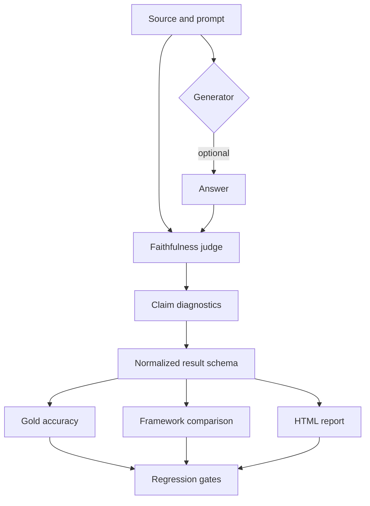
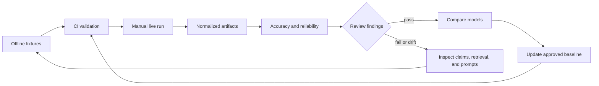

# Faithfulness Evaluation Suite

This is where TrueLearn Evals began, before Maestro existed: a personal side project to learn how
LLM-judge evaluation actually works — mechanically, from the inside — rather than from
documentation, using generic clinical-QA content, not TrueLearn data. `maestro/` (see the
[repository root README](../../README.md)) grew out of applying what this project proved.

It's kept here, and still actively referenced, because Maestro's Tier 3 directly reuses its central
discipline: **validate the judge on known-label cases before trusting it to grade a real
generator** — proven three separate ways below (Promptfoo, DeepEval, RAGAS), then carried forward
into `deepeval/faithfulness_demo.py`'s exact mechanism when Maestro's Tier 3 needed a judge of its
own.

Every judge in this part of the repo is Claude (Anthropic). All three frameworks default to OpenAI,
so pointing them at Claude is a deliberate configuration step in each one, documented below.

**All fixtures in this project (`data/*.json`) are hand-written, synthetic, generic clinical-QA
examples — not TrueLearn content, not reviewed by any TrueLearn clinician or editor.** Each carries
an explicit placeholder note saying so; see the notes on `docs/CLINICAL_REVIEW_GUIDE.md` below.

**A note on the commands throughout this doc:** they're written assuming your current directory is
the repository root (e.g. `evaluations/faithfulness/deepeval/*.py`, `tools/run_evals.py`), the same
as every command elsewhere in this repo — not this file's own folder.

## Quickstart

### 1. Run offline validation

No API key or framework installation is required:

```bash
python3 -m unittest tools/test_result_schema.py
python3 -m py_compile tools/*.py evaluations/faithfulness/deepeval/*.py evaluations/faithfulness/ragas/*.py
python3 tools/retrieval_correctness.py evaluations/faithfulness/data/metric_cases.json
python3 tools/compare_results.py evaluations/faithfulness/data/demo_results.json
```

### 2. Install the live framework environments

Use separate environments because DeepEval and RAGAS have incompatible
dependency constraints:

```bash
python3 -m venv evaluations/faithfulness/deepeval/.venv-deepeval
evaluations/faithfulness/deepeval/.venv-deepeval/bin/pip install -r requirements-deepeval.txt

python3 -m venv .venv-ragas
.venv-ragas/bin/pip install -r requirements-ragas.txt
```

### 3. Run the Python evaluations

```bash
export ANTHROPIC_API_KEY=your-key
python3 tools/run_evals.py \
  --deepeval-python evaluations/faithfulness/deepeval/.venv-deepeval/bin/python \
  --ragas-python .venv-ragas/bin/python
```

This writes normalized output to `results/python-results.json`. Generate a
shareable report with:

```bash
python3 tools/html_report.py \
  results/python-results.json \
  results/report.html
```

For Promptfoo, use Node 24 and follow [`evaluations/faithfulness/promptfoo/RUN.md`](promptfoo/RUN.md).
Live GitHub Actions runs are manual-only and require the repository
`ANTHROPIC_API_KEY` secret.

## What "faithfulness" means (and what it does not)

**Faithfulness** = does every claim in an answer trace back to the provided source material?

The critical distinction, and the throughline of this whole part of the repo: faithfulness is not the same as being true in general.

- An answer can be medically correct but unfaithful if it adds facts the source never stated.
- An answer can be faithful but useless if the source itself was wrong.

Faithfulness measures grounding in the source, nothing more. In a retrieval-augmented (RAG) medical product, this is exactly the property you want to test, because the danger isn't only "the model made something up," it's "the model stated something that isn't backed by the reviewed source material a clinician approved."

This is why faithfulness is a retrieval-plus-generation metric: it only has meaning relative to the source you give it. Change the source, and the same answer can flip from unfaithful to faithful. `04` in this repo proves that directly.

## How faithfulness is actually scored

None of these frameworks do a string match. Each one runs an LLM judge that:

1. Decomposes the answer into individual atomic claims.
2. Verifies each claim against the source material.
3. Scores the ratio: supported claims / total claims.

That ratio is why the same wrong answer can score differently across tools: each framework's judge splits the answer into a different number of claims. In this repo the identical hallucinated answer scored 0.5 in DeepEval and 0.333 in RAGAS, not because one is wrong, but because claim decomposition is itself a judgment call and the two judges chunked the sentence differently.

Practical consequence, and the rule this methodology operates by: don't chase the exact decimal. Set a high threshold for medical content, and act on which claim the judge flags as unsupported, not on whether the score was 0.33 or 0.50.

## The three actors, and the two things being tested

Every eval has three actors:

| Actor | Role |
|---|---|
| Generator | the model that writes the answer |
| Output | the answer itself (faithful or not) |
| Judge / scorer | reads the output and rules PASS / FAIL |

This part of the repo tests two different things, and keeping them straight is the whole skill:

### 1. Testing the JUDGE (`01`, `02`, and both `.py` demos)

We supply answers whose correct verdict we already know, and check the judge sorts them correctly.

- Grounded answers stay inside the source and should PASS (positive test cases).
- Adversarial answers deliberately break grounding and should FAIL (negative test cases).

Promptfoo's `echo` provider passes our handwritten answers straight through, so no model generates anything. The generator is removed from the loop entirely. The only question is: does the judge's verdict match the label defined?

You're testing the test. This is the step most people skip, and it's the one that earns trust in every score that comes after — it's exactly what Maestro's Tier 3 `run_gold_suite.py` does too, just for a different content shape.

### 2. Testing the GENERATOR (`03`, `04`)

Now the judge is fixed and trusted, real models generate answers live, and we measure the models. The roles flip: same metric, opposite thing under test.

In Promptfoo terms: the `providers:` list is the lineup of contestants, and the single `llm-rubric` provider is the one referee grading all of them. One judge, many generators, held constant so the comparison is fair.

## The 30-case suite (`02`) explained

The suite is deliberately 15 grounded + 15 adversarial, so a ~50% pass rate is by design. Rows 1-15 should be green; rows 16-30 should be red. Any row that disagrees with its label is a finding about the judge, not a bad result.

The 15 adversarial cases each encode a different hallucination type, so the suite tests breadth of detection, not just one failure:

| # | Hallucination type | Example |
|---|---|---|
| 11 | Direct contradiction | artery swap RCA to LAD |
| 12 | Fabricated addition | invented dose "10 units, dialysis in 30 min" |
| 13 | Overgeneralization | "always cures heart failure in every patient" |
| 14 | Wrong drug | epinephrine to diphenhydramine |
| 15 | Invented dose/target | "target INR of exactly 5.0 for all patients" |
| 16 | Invented mechanism | "directly rupturing hepatocyte cell membranes" |
| 17 | Swapped lab values | microcytic/low to macrocytic/high |
| 18 | Unsupported absolute | "completely safe, no side effects in any patient" |
| 19 | Conflated conditions | atrial fibrillation described as flutter |
| 20 | Out-of-scope fabrication | "coronary artery bypass surgery" for DKA |

## Key findings from the runs

- **Faithfulness is claim-decomposition, not a vibe check.** Scores are supported-claims / total-claims. The same hallucinated answer scored 0.5 (DeepEval) and 0.333 (RAGAS) because the judges decomposed it into different numbers of claims. The takeaway is to act on the flagged claim, not the decimal.

- **A more capable model can score worse on grounding.** In `03`, given a sparse source and a strict "use only the source" prompt, the larger models failed cases the terse model passed, because they added true but unsourced detail (e.g. "the RCA supplies the inferior wall of the left ventricle"). That's medically correct and not in the source, so a grounding metric correctly marks it unfaithful. Helpful elaboration is punished by a strict faithfulness check. This is counterintuitive and worth internalizing: "best model" is not a fixed property, it depends on what you're measuring.

- **The failures were unsourced-elaboration, proven by controlled experiment.** `04` is identical to `03` except the sources are enriched to contain exactly the detail the models were adding. One variable changed. The previously-failing cases flip to PASS, confirming the earlier failures were elaboration beyond the source, not fabrication. Same model, same prompt, same judge, different source, opposite verdict.

- **ERROR is not FAIL.** During development an all-ERROR run (a provider serialization bug, and separately a stale viewer showing a cached result) looked at a glance like passing/failing tests. It wasn't; the harness hadn't run. An all-error run means fix your setup; an all-fail run means interrogate the model. Conflating the two sends you debugging the wrong layer. The habit this built: never trust a result you didn't watch execute fresh (`--no-cache`).

- **Whether elaboration passes or fails is a POLICY decision, not a technical one.** If the rule is "explanations may only state what's in the reviewed source," failing the elaborations is correct. If the rule is "explanations should be accurate and may add helpful context," the rubric is too strict. That line has to be set by product and clinical reviewers, not QA alone. The eval encodes a policy; it doesn't invent it.

- **The tooling is OpenAI-first.** All three frameworks defaulted to OpenAI and had to be explicitly pointed at Claude (DeepEval via `AnthropicModel`, Promptfoo via `provider: anthropic:...`, RAGAS via a `LangchainLLMWrapper` around `ChatAnthropic`). Provisioning the judge is a real setup decision, not an afterthought, and it's the same friction in every framework — and the same reason Maestro's Tier 3 module reuses `deepeval`'s `AnthropicModel` directly rather than defaulting anywhere.

## Framework comparison

| | Promptfoo | DeepEval | RAGAS |
|---|---|---|---|
| Language | Node (YAML config) | Python (pytest-style) | Python |
| Faithfulness output | binary PASS/FAIL (rubric) | graded score + claim reasons | graded score |
| Source handling | inject `{{source}}` into rubric | `retrieval_context` first-class | `retrieved_contexts` first-class |
| Best for | fast CI, config-driven suites | detailed per-claim scoring | RAG-specific metric suite |
| Judge default | OpenAI (override to Claude) | OpenAI (override to Claude) | OpenAI (override to Claude) |

A note on why hand-rolled rubrics are risky: an early Promptfoo faithfulness rubric failed to grade correctly because the judge couldn't see the source — the `{{source}}` variable wasn't injected into the rubric text, so the judge refused to certify groundedness it couldn't check. That's the exact problem `retrieval_context` (DeepEval) and `retrieved_contexts` (RAGAS) solve by design: they pass the source to the judge as structured input. Lesson: a faithfulness scorer must be given the source, or it isn't measuring faithfulness.

## Setup

Per-framework run steps are in `evaluations/faithfulness/promptfoo/RUN.md`, `evaluations/faithfulness/deepeval/RUN.md`, and
`evaluations/faithfulness/ragas/RUN.md`. Highlights:

- Node 24+ is required for Promptfoo (Node 22 is rejected).
- DeepEval and RAGAS conflict on the `click` version if installed in the same virtualenv. Use a separate venv per framework.
- Python dependencies are pinned in `requirements-deepeval.txt` and `requirements-ragas.txt`; install the matching file rather than the aggregate `requirements.txt`.
- All scripts require `ANTHROPIC_API_KEY` in the environment:

  ```bash
  export ANTHROPIC_API_KEY=sk-ant-...
  ```

- Always `cd` into the relevant subfolder before running, and use `--no-cache` with Promptfoo to guarantee a fresh run rather than a cached result.

## Normalized results

The Python demos support a shared JSON schema with `case_id`, `score`, `passed`,
`reason`, and claim-level `claims` fields. Each claim includes its text, whether
it is supported, and the supporting evidence passages when available. Run both demos and write one combined result file
with:

```bash
python3 tools/run_evals.py \
  --deepeval-python evaluations/faithfulness/deepeval/.venv-deepeval/bin/python \
  --ragas-python .venv-ragas/bin/python
```

The two executable options are important because DeepEval and RAGAS can require
incompatible dependency versions. They default to the current Python
interpreter for convenience. The individual demos still support their original
human-readable output; append `--json` when integrating them with another
runner.

## Continuous validation

Pull requests run offline checks through
[`.github/workflows/validate.yml`](../../.github/workflows/validate.yml). These checks
cover Python syntax, the normalized result contract, patch formatting, and Maestro's
own test suites and CLI smoke tests. The
live framework evaluations remain opt-in because they require API keys and incur
model costs. Live API evaluations are available only through the manually
dispatched [faithfulness framework workflow](../../.github/workflows/faithfulness-framework-evaluation.yml).
It requires an `ANTHROPIC_API_KEY` repository secret, limits runtime to 15
minutes, and enforces an explicit maximum test count. Normal pushes and pull
requests never make provider calls — this remains true for Maestro's Tier 3 judge as well; it has
no CI wiring at all, live or offline-live.

The same manual workflow includes isolated DeepEval and RAGAS jobs. Each job
installs its pinned requirements separately because those frameworks have
incompatible dependency constraints. All three jobs have a 15-minute timeout
and require the same repository secret.

Successful live runs retain framework outputs as GitHub Actions artifacts. A
follow-up workflow builds and publishes the dependency-free HTML report as the
`faithfulness-html-report` artifact for download.

## Gold labels and accuracy

Reviewers can label cases in [`evaluations/faithfulness/data/gold_cases.json`](data/gold_cases.json)
with the expected faithfulness verdict. **These are hand-written synthetic placeholder cases, not
TrueLearn content.** The offline metrics helper accepts the
same cases with a `predicted_pass` field added by a judge adapter:

```bash
python3 tools/gold_accuracy.py predictions.json
```

It reports accuracy plus the confusion counts needed to distinguish false
positives from false negatives. The included labels are starter placeholder data and
should be replaced with reviewed data before being used as any kind of real benchmark.

Each gold case now includes `review_status`, reviewer ownership, and
claim-level `severity`/`evidence` annotations. They intentionally remain
`pending_clinician_review`; nothing here represents automated labels
as clinical approval.

See the [reviewer-workflow guide](docs/CLINICAL_REVIEW_GUIDE.md) and copy the
[review template](data/clinical_review_template.json). Do not add patient
identifiers or real clinical notes to this repository.

To score normalized framework output directly, use matching `case_id` values:

```bash
python3 tools/gold_accuracy.py \
  --gold evaluations/faithfulness/data/demo_gold_cases.json \
  --results results/python-results.json
```

The adapter fails when a gold case has no framework prediction, rather than
silently dropping it from the accuracy calculation.

## Cross-framework comparison

Compare normalized outputs from multiple frameworks with:

```bash
python3 tools/compare_results.py results/python-results.json
```

The report groups matching `case_id` values, shows each framework's score and
verdict, flags verdict disagreements, and reports score spread. This makes
claim-decomposition differences visible without treating different score
scales as interchangeable.

## Execution metadata

Normalized results can include the judge model, latency, token counts, and
estimated cost:

```json
{
  "model": "claude-sonnet-4-6",
  "latency_ms": 842,
  "input_tokens": 1200,
  "output_tokens": 180,
  "estimated_cost_usd": 0.01
}
```

Use `tools.run_metadata.summarize_metadata` to aggregate these fields across
framework runs. Missing metadata is reported explicitly rather than treated as
zero.

The DeepEval and RAGAS demos now populate `model` and `latency_ms` automatically
when run with `--json`. Token and cost fields remain optional because provider
response usage formats differ between framework versions.

Provider usage helpers in [`tools/provider_usage.py`](../../tools/provider_usage.py)
accept both Anthropic-style (`input_tokens`/`output_tokens`) and OpenAI-style
(`prompt_tokens`/`completion_tokens`) responses. Prices are passed explicitly
to `estimate_cost`; no pricing assumptions are hidden in the evaluator. Maestro's Tier 3 judge
reuses these same helpers directly rather than re-implementing usage/cost tracking.

The Python adapters inspect usage metadata exposed by the installed framework
objects. Set pricing explicitly when usage is available:

```bash
export ANTHROPIC_INPUT_USD_PER_MILLION=3
export ANTHROPIC_OUTPUT_USD_PER_MILLION=15
```

Framework versions that hide provider usage leave token and cost fields null;
the adapters never estimate usage from text length.

Transient timeout, connection, HTTP 429, and HTTP 5xx failures receive bounded
exponential retries through [`tools/retry.py`](../../tools/retry.py) — also reused directly by
Maestro's Tier 3 judge. Permanent errors are raised immediately. The shared runner also applies a per-framework timeout
and configurable attempt limit:

```bash
python3 tools/run_evals.py --timeout-seconds 900 --attempts 2
```

Retry events are emitted as structured JSON to stderr, keeping normalized JSON
results on stdout clean for pipelines. Events include the operation name,
attempt number, next attempt, and error type.

The offline CI suite also validates security-critical workflow invariants,
including read-only permissions, manual-only live execution, API-key checks, and
job timeouts.

## HTML report

Generate a shareable, dependency-free report from normalized results:

```bash
python3 tools/html_report.py \
  evaluations/faithfulness/data/demo_results.json \
  results/report.html
```

The report includes framework, case, score, verdict, reason, and cross-framework
agreement when multiple frameworks are present.

Promptfoo output is normalized with:

```bash
python3 tools/promptfoo_results.py \
  evaluations/faithfulness/promptfoo/.promptfoo/output.json \
  results/promptfoo-result.json
```

The adapter preserves Promptfoo case IDs, scores, verdicts, reasons, latency,
provider, and token usage in the shared schema.

## Regression baselines

Store approved metrics in a baseline JSON file and compare new runs:

```bash
python3 tools/regression.py \
  evaluations/faithfulness/data/regression_baseline.json \
  evaluations/faithfulness/data/regression_current.json
```

The default gates allow at most a five-point accuracy drop and 25% increases in
latency or estimated cost. A failed gate returns a non-zero exit code for CI.

## Judge reliability

Analyze repeated framework runs with:

```bash
python3 tools/reliability.py evaluations/faithfulness/data/reliability_fixture.json
```

The report shows per-case verdict agreement, verdict flips, mean score, and
population score standard deviation. Repeated runs expose borderline cases that
single-run evaluations can hide.

`evaluations/faithfulness/data/multi_judge_fixture.json` demonstrates comparing three judge models with
the same cases. Replace the fixture with normalized live outputs to measure
model disagreement before selecting a production judge.

### Optional live multi-judge add-on

The fixture can later be replaced by a capped live orchestrator that sends the
same cases to multiple judge models:

```bash
python3 tools/run_multi_judge.py \
  --cases evaluations/faithfulness/data/gold_cases.json \
  --models judge-a,judge-b,judge-c \
  --max-cases 10
```

This is intentionally an add-on rather than part of pull-request CI. Each
case/model combination creates a provider call, so three judges evaluating ten
cases means up to 30 calls. Keep the command manual, use a small case limit,
and run the existing reliability/comparison tools on the normalized outputs.
The repository currently includes the offline fixture and analysis step; the
orchestrator command is a planned extension requiring provider-specific model
configuration and API credentials.

## Result schema versioning

Normalized results include `schema_version`. Legacy files without a version can
be upgraded with:

```python
from tools.schema_migrations import migrate_result

current = migrate_result(legacy_result)
```

Readers reject future schema versions they do not understand instead of
silently misinterpreting fields.

## Privacy scanning

Before sharing evaluation artifacts, scan them for common sensitive patterns:

```bash
python3 tools/privacy_scan.py results/report.html
```

The scanner detects API keys, email addresses, phone numbers, and medical
record numbers. It reports only category and character offset, never the
detected value. This is a safeguard, not a replacement for real privacy review.

## Evaluation architecture



The framework-specific adapters keep Promptfoo, DeepEval, and RAGAS
replaceable while the shared result schema makes their outputs comparable.
Offline fixtures validate the harness; manual live workflows validate provider
integrations without making API calls part of pull-request CI.

## Evaluation quality loop



This loop separates deterministic harness checks from provider-dependent
evaluation runs. Findings feed back into cases, prompts, retrieval checks, or
baselines instead of being hidden inside a single aggregate score.

## Retrieval and answer correctness

Faithfulness does not measure whether retrieval found the right evidence or
whether the answer is medically correct. The starter dataset in
[`evaluations/faithfulness/data/metric_cases.json`](data/metric_cases.json) records relevant and
retrieved context IDs plus an answer-correctness label. Run:

```bash
python3 tools/retrieval_correctness.py evaluations/faithfulness/data/metric_cases.json
```

The report includes macro-averaged retrieval precision, recall, F1, and answer
correctness. These labels are intentionally separate from faithfulness labels:
an answer can be faithful to an incomplete or incorrect source.

## Results and limitations

The current fixtures demonstrate the complete workflow: adversarial judge
validation, normalized cross-framework comparison, claim-level diagnostics,
regression thresholds, repeated-run reliability, privacy checks, and a
multi-judge disagreement example. They are intentionally small and synthetic
so this part of the repo can run offline and remain safe to share.

This is a reference evaluation methodology, not a clinical decision-support system, and not
TrueLearn production tooling. The
starter gold labels still require qualified review, faithfulness does
not establish medical correctness or safety, and provider token/cost metadata
may be unavailable. Live results can also vary with model versions, prompts,
retrieval context, and judge calibration.

## Methodology lessons carried into Maestro's Tier 3

These are the concrete lessons this reference implementation produced, and each one directly
shaped a decision in Maestro's Tier 3 (above) rather than staying abstract:

- Building faithfulness evals across three frameworks and reconciling their differences → led to
  picking `deepeval`'s proven mechanism for Tier 3 instead of hand-rolling a new judge prompt.
- Validating the judge on known-label cases before trusting it to grade live model output → is
  exactly what `maestro/judge/run_gold_suite.py` does, adapted to Maestro's content shape.
- Designing an adversarial suite that covers distinct hallucination types → informed the 3
  different failure modes (contradiction, unsupported addition, wrong attribution) in Tier 3's own
  6-case synthetic suite.
- Distinguishing harness errors from genuine eval failures → is why Tier 3's tests only assert the
  wrapping code is correct, never that the judge itself is right (that requires a live run and a
  human reading the output).
- Recognizing where a technical metric ends and a content/policy decision begins → is why Tier 3's
  verdicts are explicitly labeled "not evidence" until measured against real SME agreement.
